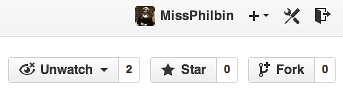
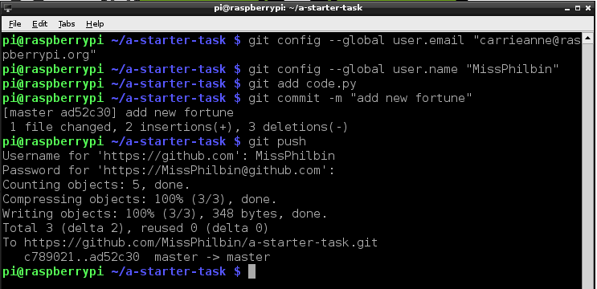
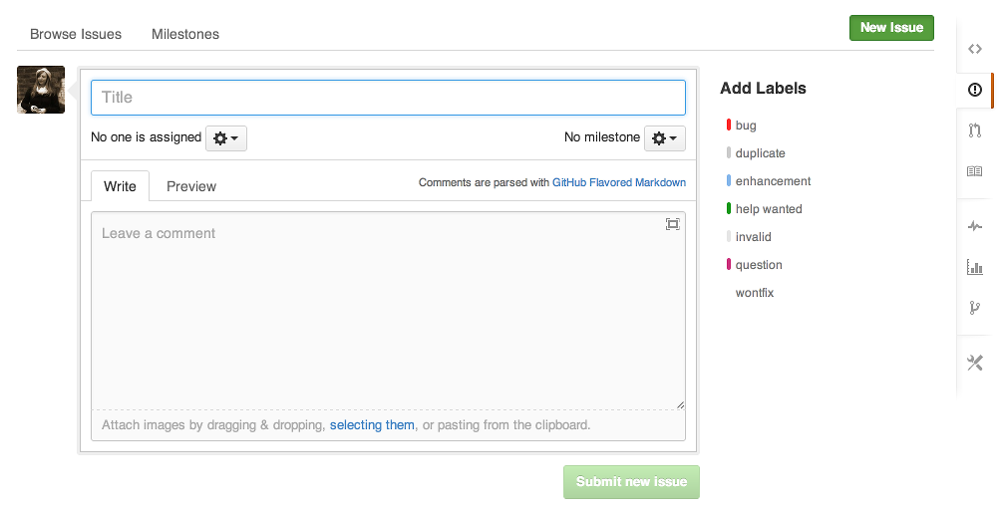
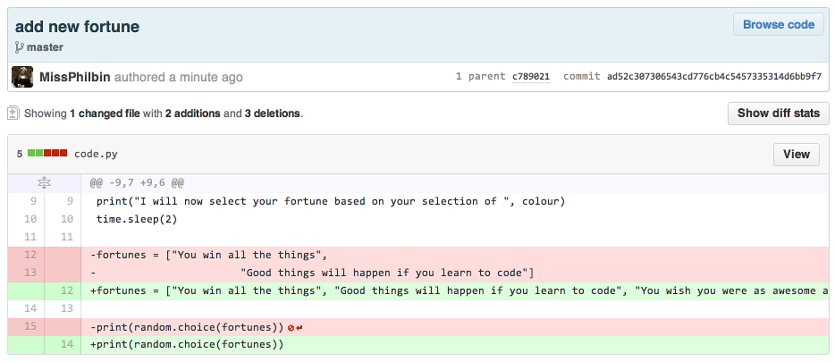

# A starter task for using GitHub in Education with Raspberry Pi

##Introduction

Interested in innovative ways to assess students' work on Raspberry Pis in the classroom? Then GitHub in Education could provide a good answer. This tutorial will demonstrate how you could use GitHub to give students some starter code to adapt, and how you can assess their changes to the code. If you are new to GitHub then this could be a steep learning curve, so dedicate an hour to sitting down and following the steps below. 

##Step 1: Do you have a GitHub account?

Make sure that you have signed up for [GitHub here](https://github.com/). You can do this on a computer connected to the internet. This [GitHub cheat sheet may come in handy](https://education.github.com/git-cheat-sheet-education.pdf) as a reference guide too.

##Step 2: Make a copy of this *repository*

A repository is a type of folder or directory on GitHub. Making a copy of a repository is called **forking**. Click on the 'Fork' button at the top of the screen on the right hand side, and a copy of everything in this repository called **a-starter-task** will appear in your account.



##Step 3: Locate the code!

To locate the code file, navigate back to your account. You can do this by clicking on your username at the top of the page. Now find the starter code file called `code.py`. The code will look like this but will be in a text file:

```python
import random
import time

print("Welcome to my fortune teller")

question = input("Would you like me to tell your fortune?\n")
colour = input("What is your favourite colour?\n")

print("I will now select your fortune based on your selection of ", colour)
time.sleep(2)

fortunes = ["You win all the things", "Good things will happen if you learn to code"]
			
print(random.choice(fortunes))

```			

##Step 4: Copy the code to your Raspberry Pi

Now that you have the starter task repository in your GitHub account, let's clone it to your Raspberry Pi to make the program better!

1. First set up your Raspberry Pi and log in. You can follow [the Raspberry Pi quick start guide here](http://www.raspberrypi.org/help/quick-start-guide/) if you are unsure how to do this. Once you have booted your Pi, log in.

	*Note: You will need to be connected to the internet in order to clone the repository to your Pi*

2. Either from the **command line** or from an **LXTerminal** window, type the following command to clone the GitHub repository on your GitHub account, and press **enter**:

	```
	git clone https://github.com/user/a-starter-task.git
	``` 
	*Note that you need to replace 'user' with your account name. e.g. MissPhilbin*

3. GitHub may ask you to log into your account with your username and password at this point.

4. Once you have cloned the repository, you will see a new directory added to the Raspberry Pi file structure; this is the repository, sometimes shortened to 'repo'. You can change directory into it using `cd a-starter-task` and then type `ls` to see the files contained within it. These will include the code file which you want to change, called `code.py`.	

##Step 5: Change the code

With the starter code successfully cloned to your Raspberry Pi, you will be able to change it and add your own style/twist. 

1. If you are comfortable with using the command line, then you can use text editors like **nano** to adapt the code. Otherwise, boot to the desktop by typing `startx`.
2. Open **IDLE3** by double-clicking on the desktop icon. 

	

3. Click on **File** and **Open**.
4. Naviagte to where you saved `code.py` and select it.
5. Click **Open**.
6. Now add some more fortune statement strings to the list at the bottom. Currently there are two; add at least 5 more.
7. When completed, test your code works by saving it and clicking on **Run** followed by **Run Module**.

##Step 6: Upload the changed code to GitHub

1. Open an **LXTerminal** window by double-clicking on the desktop icon.
2. Change directory to where your updated code file is located by typing `cd a-starter-task`.
2. Next, configure your email address and name on your Raspberry Pi, so that when you commit your changes you can see who made the commit. Type:

	```
	git config --global user.email "you@example.com"
	git config --global user.name "Your Name"
	```
3. Type `git add code.py` and press **enter**.
4. Then type `git commit -m "my commit message"`. *Note that the commit message acts as a reminder for you or your collaborators about what you have done to the file.*
5. Finally, type `git push` to finalise the commit to GitHub. You will be asked for your GitHub username and password in order to complete this step.



If your Raspberry Pi is not connected to the internet, another method is to save your amended `code.py` file onto a USB memory stick connected to the Pi. Then log into your GitHub account with a computer or laptop, and open the file by clicking on the `code.py` file in your forked repository. (This is not our original file!) Click on **edit**; you can then paste your new code from the file on the USB memory stick. To save your code you need to **commit** it to the repository. You will notice that there is a comment box where you can describe the code that you have changed. Add an explanation here and then click on **Commit Changes**.

##Step 7: Share and comment

You can comment on the files in a student's repository, and give feedback, by navigating to their forked version of the repo and then clicking on the **issues** button on the right hand side of the screen. (The icon looks like an exclamation mark in a circle.) You can then fill out a comment box and submit it. This could be a useful way for you to mark a student's work. 



You can also track the changes that students have made to the code in their repositories by clicking on the **History** button on their file within their GitHub repo. This is a great way to demonstrate progress without too much effort!



##Step 8: Learn more about GitHub in Education

You can learn more about how to use [GitHub in Education here](https://education.github.com/guide), including steps on administering accounts for students. 

Follow [Ben](http://github.com/bennuttall) or [Carrie Anne](http://github.com/missphilbin) and anyone else from [Picademy](https://github.com/picademy) to learn more or get help with using GitHub on Raspberry Pi in the classroom.
