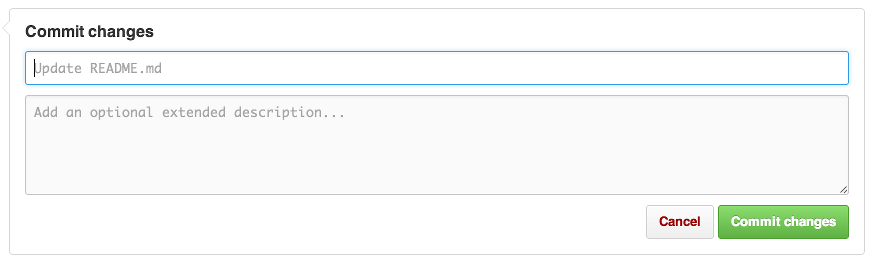

# A Starter Task for using GitHub in Education with Raspberry Pi

##Introduction

Interested in innovative ways to assess students work on Raspberry Pis in the classroom? Then GitHub for Education could provide a good answer. This tutorial will demonstrate how you could use GitHub to give students some starter code to adapt, and how you can assess their changes.

##Step 1: Do you have a GitHub account?

Make sure that you have signed up for [GitHub here](https://github.com/). This [GitHub cheat sheet may come in handy](https://education.github.com/git-cheat-sheet-education.pdf) too.

##Step 2: Make a copy of this *repository*

A repository is a type of folder on GitHub. Making a copy of a respoistory is called **forking**. Click on the 'Fork' button at the top of the screen on the right hand side, and a copy of everything in this repository called **a-starter-task** will appear in your account.


##Step 3: Locate the code!

Now navigate back to your account and find the starter code called **code.py**. The code will look like this but will be in a text file:

```python
import random
import time

print("Welcome to my fortune teller")

question = input("Would you like me to tell your fortune?\n")
colour = input("What is your favourite colour?\n")

print("I will now select your fortune based on your selection of ", colour)
time.sleep(2)

fortunes = ["You win all the things",
			"Good things will happen if you learn to code"]
			
print(random.choice(fortunes))

```			

##Step 4: Copy the code to your Raspberry Pi

Now that you have the starter task repository in your GitHub account, let's clone it to your Raspberry Pi to make the program better!

First, set up your Raspberry Pi and log in. You can follow [the Raspberry Pi quick start guide here](http://www.raspberrypi.org/help/quick-start-guide/).

*Note: You will need to be connected to the internet in order to clone the repository to your Pi.*


##Step 5: Change the code

1. Open **IDLE3** by double-clicking on the desktop icon. 
2. Click on **File** and **Open**
3. Navigate to where you saved **code.py** and select it.
4. Click **Open**
5. Now add some more fortune statement strings to the list at the bottom. Currently there are two; add at least five more.
6. When completed, test your code works by saving it and clicking on **Run** followed by **Run Module**

##Step 6: Upload the changed code to Github

The easiest way for you to do this without having to use the command line is to open the file on GitHub by clicking on the **code.py** file in your forked repository. (Not our original!) Then click on **edit**. You can then paste your new code over the top. To save your code you need to **commit** it to the repository. You will notice that there is a comment box in which you can give a description to the code that you have changed. Add an explanantion here and then click on **Commit Changes**.



##Step 7: Share and Comment

Follow [Ben](http://github.com/bennuttall) or [Carrie Anne](http://github.com/missphilbin) and anyone else from Picademy. Then you will be able to see their forked repositories and their changed versions of code.py.

You can comment on their work and give feedback by navigating to their forked respository and then clicking on the **issues** button on the right hand side of the screen. The icon looks like an exclamation mark in a circle. Then you can fill out a comment box and submit it. 


##Step 8: Learn more about GitHub in Education

You can learn more about how to use [GitHub in Education here](https://education.github.com/guide), including steps on administrating accounts for students. 
